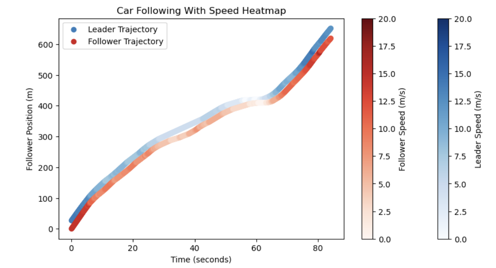
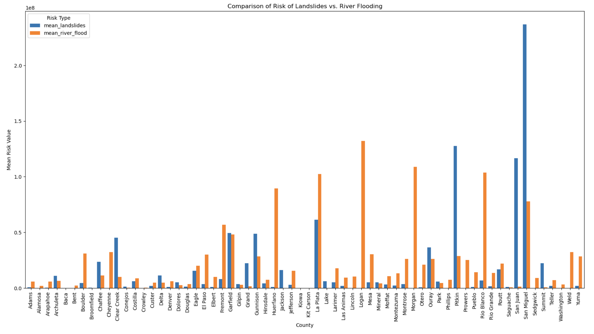

# Kaden Hayes

Welcome to my personal website! Here you'll find information about my background, projects, and interests.

---

## About Me

I am an undergraduate student in Civil Engineering at the University of Nebraska-Lincoln.  
My interests include *data analytics*, and `Python programming`.

---

## Skills

- Python  
- Data Visualization (Matplotlib, Seaborn)  
- Data Analysis  
- Markdown, Git, GitHub Pages
- Project Planning and Scheduling

---

## Projects

### Project 1: Traffic Analysis
  
Using Python and the pandas and numpy packages I analyzed the data. Then I used the Matplotlib and Seaborn packages to visualize the data in a graph. We did this to look at the data in a much easier and simpler way to understand. Throughout this project I learned how to create graphs in python as well as how to sort through data.  

[View the code](project1_code.ipynb)

---

### Project 2: Risk Analysis of Colorado and Idaho
  
A short description of this project. What problem did it solve? What did you learn?
In this project I used python using pandas and numpy packages to analyze and sort the data. Then I created my own risk analysis function to calculate the amount of risk for a certain natural disaster in each state and compared them against each other. This was done to compare the two states risks for certain natural disasters. From this project I learned how to sort large datasets and pick out the information that is more important and useful. 

---

## Connect With Me

- [LinkedIn](https://www.linkedin.com/in/kaden-hayes-357a30364)  
- [GitHub](https://github.com/KHayes77)  
- [Email Me](mailto:khayes12@unl.edu)

---

## Navigation

- [Home](index.md)  
- [About Me](about.md)  
- [Projects](projects.md)  
- [Contact](contact.md)
